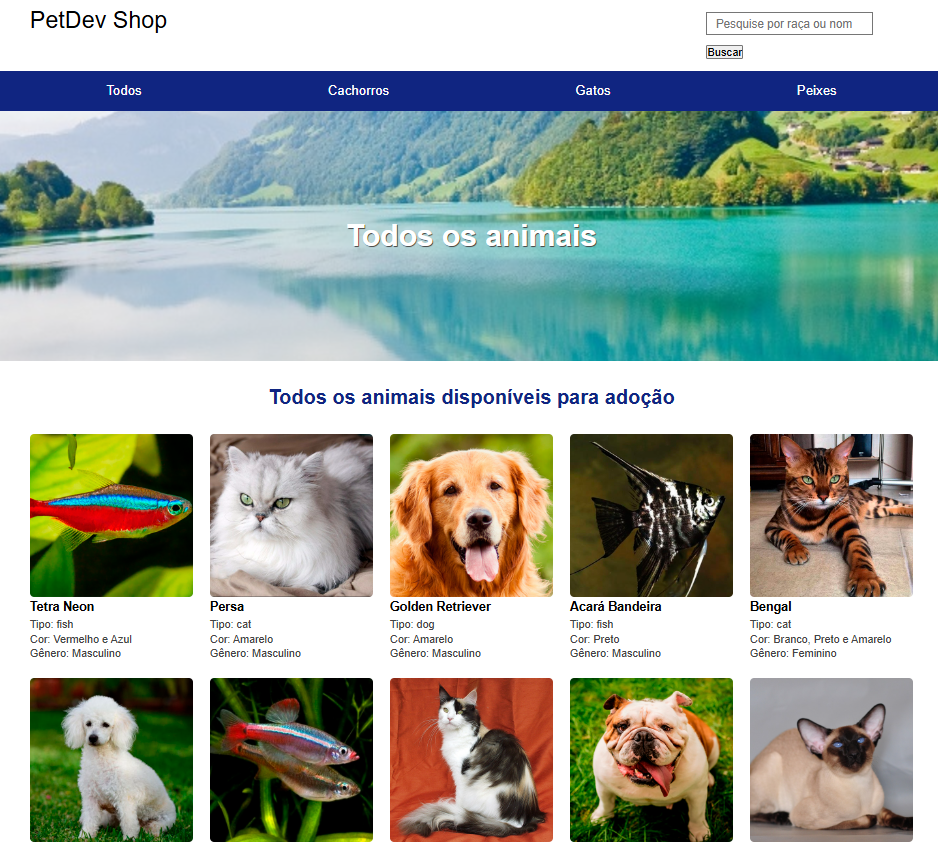

# PetShop Application

## 💻 Descrição do projeto

Este projeto é uma aplicação para gerenciamento de informações de um pet shop. Ele foi desenvolvido para facilitar a busca por animais disponíveis, organização das páginas, e um banco de dados eficiente para armazenar informações relevantes. A aplicação é totalmente funcional, com rotas organizadas e visualizações personalizadas.

> **Colaboração:** Not found  
> **Status:**  Concluído ✔️  

  
👀 Prévia

  

## 📜 Índice

- [Descrição](#-descrição-do-projeto)
- [Conceitos Aprendidos](#-conceitos-aprendidos)
- [Tecnologias Utilizadas](#-tecnologias-utilizadas)
- [Instalação](#-instalação)
- [Uso](#-uso)
- [Funcionalidades](#-funcionalidades)
- [Pendências](#-pendências)
- [Contribuição](#-contribuição)
- [Informações Adicionais](#-informações-adicionais)
- [Licença](#-licença)
- [Conclusão](#-conclusão)

## ✅ Conceitos Aprendidos 

- Estruturação de projetos em TypeScript.
- Uso de templates Mustache para criar visualizações dinâmicas.
- Criação de rotas e controladores no Express.
- Gerenciamento de banco de dados em um arquivo dedicado.
- Organização de arquivos e arquitetura de projeto escalável.

## 🛠 Tecnologias Utilizadas

## ⚙ Instalação

Para começar a usar este projeto, siga as etapas abaixo:

1. Faça um fork do repositório:
   <pre>git fork https://github.com/IgoRenatoo/NodeJs-B7Web-ProjectsCourseNodeJs.git</pre>

2. Clone o seu fork para sua máquina:
   <pre>git clone https://github.com/IgoRenatoo/NodeJs-B7Web-ProjectsCourseNodeJs.git</pre>

3. Acesse o diretório do projeto:
   <pre>cd 01-PetShop</pre>

4. Instale as dependências:
   <pre>npm install</pre>

## 🚀 Uso 

1. Execute o comando `npm run dev` no terminal.

2. Acesse a URL http://localhost:3000/ ou as rotas principais utilizando um cliente HTTP (como Postman ou Insomnia).

### Exemplos de rotas disponíveis:

- `GET /` - Página inicial, exibi todos os pet's disponíveis.
- `GET /search` - Busca animais com base em um parâmetro de pesquisa.
- `GET /cat` - Página dedicada a gatos.
- `GET /dog` - Página dedicada a cachorros.
- `GET /fish` - Página dedicada a peixes.

## 🧩 Funcionalidades

1. **home()**
   - Exibe todos os pets com a função getPet.getAll() e renderiza a página inicial com um banner e lista de todos os animais.

2. **dog()**
   - Exibe somente os cachorros, utilizando getPet.getDog(), e renderiza a página com um banner específico para cachorros.

3. **cat()**
   - Exibe somente os gatos, utilizando getPet.getCat(), e renderiza a página com um banner específico para gatos.

4. **fish()**
   - Exibe somente os peixes, utilizando getPet.getFish(), e renderiza a página com um banner específico para peixes.

5. **search()**
   - Realiza a busca de pets com base na palavra-chave recebida via query string, utilizando getPet.searchByName(query), e exibe os resultados na página de pesquisa.

## ⏳ Pendências

Atualmente o código está completo, sem pendências identificadas.

## 🤝 Contribuição 

Contribuições são bem-vindas! Se você deseja contribuir com este projeto, siga as etapas abaixo:

1. Faça um fork deste repositório.
2. Clone o seu fork para sua máquina (`git clone https://github.com/seu_usuário/NodeJs-B7Web-ProjectsCourseNodeJs.git`).
3. Crie uma branch para sua feature ou correção de bug (`git checkout -b nome-da-sua-branch`).
4. Commit suas alterações (`git commit -m 'Mensagem desejada'`).
5. Push para a branch (`git push origin nome-da-sua-branch`).
6. Abra um Pull Request.
7. Aguarde à análise.

## 💡 Informações adicionais

- Configuração do servidor feita com Express.js.
- Visualizações geradas utilizando Mustache.js.
- Código modular para fácil manutenção e escalabilidade.
- Arquitetura de diretórios bem definida para organização do projeto.
- Aplicado arquitetura MVC e clean coding.

## 🔓 Licença

Este projeto está licenciado sob a Licença MIT.

## 🏁 Conclusão

O projeto PetShop proporcionou uma oportunidade para aplicar conceitos importantes de TypeScript, organização de diretórios e manipulação de templates dinâmicos.

Ele é um exemplo funcional de como estruturar aplicações Node.js de maneira escalável.

💡 `💻 Código é como mágica... até você esquecer uma vírgula!`
